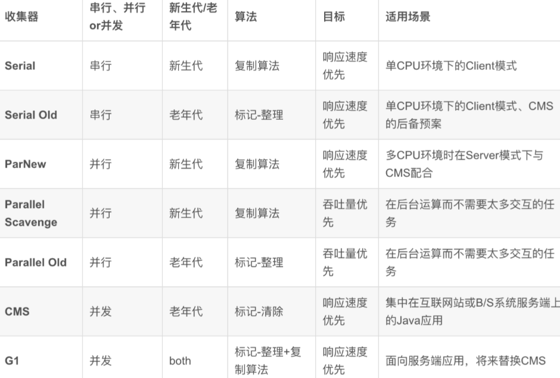
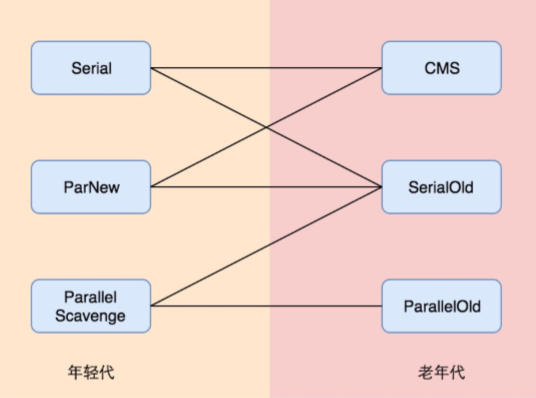

学习笔记
## GC背景与一般原理  ##
内存资源有限 
Jvm管理内存 
### 什么时候回收 ###
引用计数法、可达性分析 
**引用计数法**：给对象添加一个引用计数器，每当有一个地方引用它，计数器加1，一个引用失效，计数器减1，计数器为0表示对象不被引用，可以回收。  
如果出现循环引用，如a引用b，b引用c，c引用d，d引用a，环上对象的引用计数器至少为1，如果环没法打断，则计数永远不会变成0，永远不可能被回收掉。 
对象没有被使用，内存中对象又在增加，这种现象叫内存泄漏， 
内存泄漏的增加，整个jvm没有内存可用，就出现内存溢出。 
解决方法，引用计数->引用跟踪 
**可达性分析**：设立若干根对象GC Root，每个对象都是一个子节点，以GC Roots为起点进行搜索，可达对象是存活的，不可达对象可被回收。 
### 怎么回收 ###
**标记清除算法**：标记—从根对象出发，遍历所有的可达对象，并在本地内存native中分门别类记下来。
清除—保证了不可达对象所占用的内存，在之后进行内存分配时可以重用。 
优势：成环的对象，不被标记，因为不可达，解决了循环依赖。 
并行GC和CMS基本原理—标记清除Mark and Sweep 
**标记清除整理/压缩整理算法**：只进行了清除，内存是离散的不是连续的一块，因此需要进行压缩整理。
系统运行过程中，对象不断创建，对象之间的关系也在改变，清理阶段可能出现上一次不可达对象下一次被引用了成了可达对象，因此使用STW，让全世界停止下来，再去标记、清除、整理（移动/剪切）后，再开始运行。 
**复制算法**：
将内存划分为大小相等的两块，每次只使用其中的一块，当这一块内存用完了，通过可达性分析标记存活对象，将存活对象复制到另一块上面，然后再把当前这块内存空间进行清理。
### 分代假设 ###
大部分新生对象很快无用；存活较长时间的对象（几次GC后仍然存活），可能存活更长时间。 
有了年轻代和老年代的划分，新创建的对象，经历几次Yong gc还存活，少数几次没有到达阈值，放在年轻代.
经过很多次Yong gc，如jvm默认15，仍然存活，就挪到老年代。 
年轻代大量对象被回收，gc操作频繁，使用复制。 
老年代存活时间长，gc频率低，使用标记整理(移动)。(移动就是剪切) 
年轻代分为Eden，S0和S1。S0和S1有一个是空的，默认比例是8:1:1，创建新对象能使用的内存是90%，空的Survivor为了使用复制算法进行内存回收。 
### GC时对象在内存池之间转移 ###
对象分配在新生代的Eden区。 
标记阶段Eden存活的对象就会复制到存活区S0即from区。 
两个存活区from和to，互换角色。对象存活到一定周期会提升到老年代。 
由如下参数控制提升阈值： 
-XX:+MaxTenuringThreshold=15 
老年代默认都是存活对象，采用移动方式： 
（1）标记所有通过GC roots可达的对象 
（2）删除所有不可达对象 
（3）整理老年代空间中的内容，方法是将所有的存活对象移动，从老年代空间开始的地方依次存放。 

持久代/元数据区 
1.8之前-XX:MaxPermSize=256m 
1.8之后-XX:MaxMetaspaceSize=256m 
为什么是复制不是移动？ 
移动类似剪切，复制直接复制一份； 
### GC处理一般过程 ###
GC Roots不止一个。 
可以存在跨年轻代和老年代的GC ROOTS（有些对象gc之后被提升至老年代，但是新生代仍然存在引用关系，就出现跨代），需要单独的集合记录跨代的引用关系如rset（remember set）。有了这个集合在处理每一代的对象的时候，就不需要处理整个堆内存所有代，处理年轻代只需要处理年轻代所有对象和rset中指向年轻代的对象。 

可以作为GC Roots的对象： 
（1）当前正在执行的方法里的局部变量和输入参数 
（2）活动线程 
（3）所有类的静态字段static field 
（4）JNI引用，一些外部的引用 
垃圾回收阶段暂停的时间，与堆内存大小，对象的总数没有直接关系，而是由存活对象的数量来决定，存活对象少，时间短。所以增加堆内存的大小不会直接影响标记阶段占用的时间。 
## 串行GC（Serial GC）/ParNewGC ##
-XX:+UseSerialGC配置串行GC 
串行GC年轻代使用标记-复制算法，老年代使用标记-清除-整理算法。 
两者都是单线程的垃圾收集器，不能并行处理，所以会触发全线暂停STW，停止所有应用线程。 
不能充分利用多核cpu，不管多少cpu内核，jvm在垃圾回收时都只能使用单个核心。 
cpu利用率高，暂停时间长。电脑容易卡死。 
只适合几百MB堆内存的JVM，而且是单核cpu时比较有用。 
-XX:UseParNewGC改进版本的串行GC，单线程处理改成多线程处理，可以配合CMS使用。 
## 并行GC（Parallel GC） ##
-XX:UseParallelGC 
-XX:UseParallelOldGC 
-XX:UseParallelGC –XX: UseParallelOldGC 
以上三种都可以打开并行GC，一个是young区使用并行gc，一个是old区使用并行gc。 
不能和串行gc、ParNew、CMS底层实现不一样，不能搭配使用。 
年轻代和老年代的垃圾回收都会触发STW事件。 
年轻代使用标记-复制mark-copy算法，老年代使用标记-清除-整理mark-sweep-compact算法。 
-XX:ParallelGCThreads=N来指定GC线程数，默认值为CPU核心数。 

并行垃圾回收器适用于多核服务器，主要目标是增加吞吐量。因为对于系统资源的有效使用，能达到更高的吞吐量： 
在GC期间，所有CPU内核都在并行清理垃圾，所以总暂停时间更短。 
在两次GC周期（这一次gc和下一次gc）的间隔期，没有GC线程在运行，不会消耗任何系统资源。 

并行gc默认分配： 
最大堆内存MaxHeapSize---如果机器超过1G，默认是1/4， 
初始yong区堆大小MaxNewSize---物理内存的1/64，与gc算法、jdk版本还有关 
Jdk8和8之前都是默认并行gc 
Jdk9开始都是G1 
## CMS GC ##
CMS在老的gc框架上实现的，一般与ParNew搭配使用。 
-XX:+UseConcMarkSweepGC 
年轻代采用STW方式的mark-copy标记复制算法，老年代主要使用并发mark-sweep标记清除算法。 
CMS GC的设计目标是避免在老年代垃圾收集时出现长时间的卡顿，主要通过两种手段达成： 
（1）不对老年代进行整理，而是使用空闲列表free-lists来管理内存空间的回收。 
单独有个列表，存空闲内存的位置。 
（2）在mark-and-sweep标记清除阶段的大部分工作和应用线程一起并发执行。也就是说，在这些阶段并没有明显的应用线程暂停。但值得注意的是，它仍然和应用线程争抢cpu时间。默认情况下，CMS使用的并发线程数等于cpu核心数的1/4。 
如果服务器是多核cpu，并且主要调优目标是降低gc停顿导致的系统延迟，那么使用CMS是个明智的选择。进行老年代的并发回收时，可能会伴随多次年轻代的minor GC。 
好处：每次gc时暂停时间比并行gc短 
坏处：比之前的gc复杂很多，整体gc效率不高，与业务线程一起抢cpu资源。 
并行与并发的区别： 
并发：一部分线程进行gc，一部分处理业务 
并行：多个线程进行gc，业务线程全部暂停 
CMS GC中一些参数： 
maxNewSize：最大年轻代大小与Xmx大小为多少无关，是由64*4*13/10=332.75MB计算得到。 
64是64位的机器，4是并行的线程数，13/10是一个固定的系数。 
其他参数与并行gc一致。 
## CMS GC---六个阶段 ##
或7个阶段，第3个阶段也可以分成2个阶段 
CMS只作用于老年代 
### Initial Mark初始标记 ###
伴随STW暂停，第一个阶段暂停时间很短。初始标记的目标是标记所有的根对象，包括根对象直接引用的对象，以及被年轻代中所有存活对象所引用的对象（rset）（老年代单独回收）。
### Concurrent Mark并发标记 ###
在此阶段，CMS GC遍历老年代，标记所有的存活对象，从前一阶段“Initial Mark”找到的根对象开始算起。“并发标记”阶段，就是与应用程序同时进行，不用暂停的阶段。
### Concurrent Preclean并发预清理 ###
此阶段同样是与应用程序并发执行的，不需要停止应用线程。因为前一阶段（并发标记）与程序并发执行，可能有一些引用关系已经发生了改变。如果在并发标记过程中引用关系发生了变化，JVM会通过“Card”卡片的方式将发生了改变的区域标记为“脏”区，这就是所谓的卡片标记(Card Marking)。
### Final Remark最终标记 ###
最终标记阶段是此次GC事件中的第二次（也是最后一次）STW暂停。本阶段的目标是完成老年代中所有存活对象的标记。因为之前的预清理阶段是并发执行的，有可能GC线程跟不上应用程序的修改速度。所以需要一次STW暂停来处理各种复杂的情况。通常CMS会尝试在年轻代尽可能空的情况下执行Final Remark阶段，以免连续触发多次STW事件。
### Concurrent Sweep并发清除 ###
此阶段与应用程序并发执行，不需要STW停顿。JVM在此阶段删除不再使用的对象，并回收它们占用的内存空间。
### Concurrent Reset并发重置 ###
此阶段与应用程序并发执行，重置CMS算法相关的内部数据，为下一次GC循环做准备。 

CMS垃圾收集器在减少停顿时间上做了很多复杂而有用的工作，用于垃圾回收的并发线程执行的同时，并不需要暂停应用线程。CMS也有一些缺点，最大的问题就是老年代内存碎片问题（因为没有压缩整理），在某些情况下GC会造成不可预测的暂停时间，特别是堆内存较大的情况下。 
## G1 GC ##
G1的全称是Garbage-First，意为垃圾优先，哪一块的垃圾最多就优先清理它。 
G1 GC最主要的设计目标是：将STW停顿的时间和分布，变成可预期且可配置的。 
事实上，G1 GC是一款软实时垃圾收集器，可以为其设置某项特定的性能指标。为了达成可预期停顿时间的指标，G1 GC有一些独特的实现。 
首先，堆不再分成年轻代和老年代，而是划分为多个（通常为2048个）可以存放对象的小块堆区域（smaller heap regions）。每个小块，可能一会儿被定义为Eden区，一会儿被指定为Survivor区或者Old区。在逻辑上，所有的Eden区和Survivor区合起来就是年轻代，所有的Old区拼在一起就是老年代。 
-XX:+UseG1GC –XX:MaxGCPauseMillis=50(一般不用默认值) 
这样划分之后，使得G1不必每次都去收集整个堆空间，而是以增量的方式来进行处理：每次只处理一部分内存块，称为此次GC的回收集(Collection set)。每次GC暂停都会收集所有年轻代的内存块，但一般只包含部分老年代的内存块。 
G1的另一项创新是，在并发阶段估算每个小堆块存活对象的总数。构建回收集的原则是：垃圾最多的小块会被优先收集。 
## GC对比 ##

## GC组合 ##

常用的组合为：  
（1）Serial+Serial Old实现单线程的低延迟 垃圾回收机制； 
（2）ParNew+CMS，实现多线程的低延迟垃 圾回收机制； 
（3）Parallel Scavenge和Parallel Scavenge Old，实现多线程的高吞吐量垃圾 回收机制； 
## ZGC ##
-XX：+UnlockExperimentalVMOptions -XX:+UseZGC -Xmx16g
ZGC最主要的特点包括:  
1. GC 最大停顿时间不超过10ms  
2. 堆内存支持范围广，小至几百MB 的堆空间，大至4TB 的超大堆 内存（JDK13升至16TB）  
3. 与G1 相比，应用吞吐量下降不超过15%  
4. 当前只支持Linux/x64 位平台，JDK15后支持MacOS和 Windows系统 
## Shennandoah GC ##
-XX：+UnlockExperimentalVMOptions XX:+UseShenandoahGC -Xmx16g 
Shenandoah GC立项比ZGC更早，设计为 GC线程与应用线程并发执行的方式，通过 实现垃圾回收过程的并发处理，改善停顿时 间，使得GC执行线程能够在业务处理线程 运行过程中进行堆压缩、标记和整理，从而 消除了绝大部分的暂停时间。  
Shenandoah 团队对外宣称Shenandoah GC的暂停时间与堆大小无关，无论是200 MB 还是200 GB的堆内存，都可以保障具有 很低的暂停时间（注意:并不像ZGC那样保 证暂停时间在10ms以内）。 

